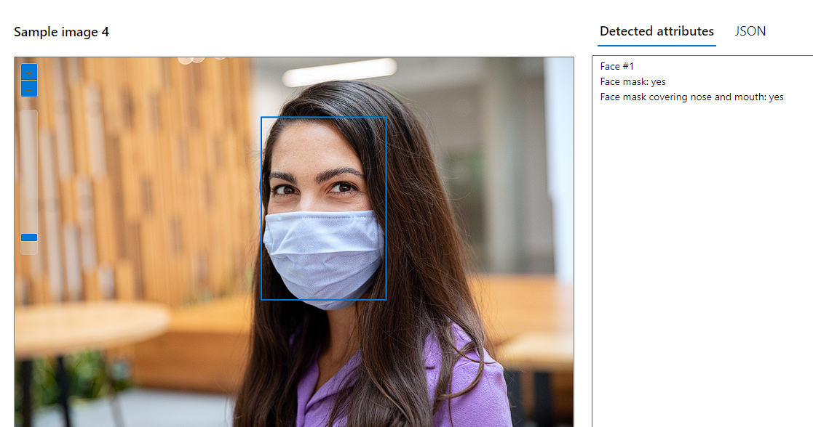
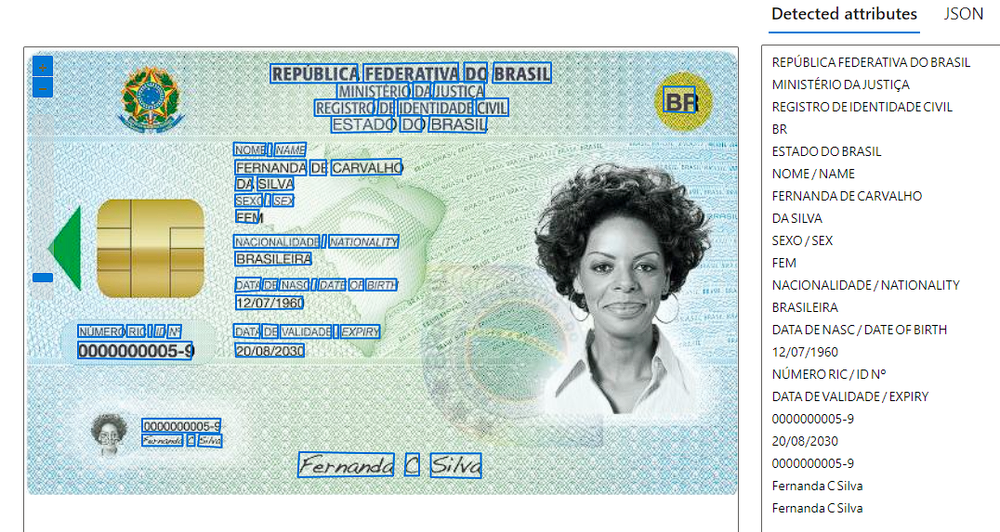
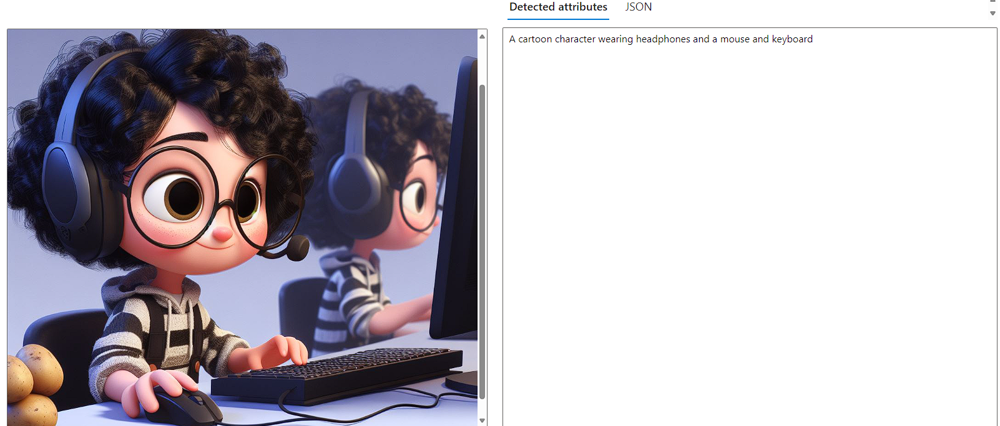

# 🧪 Lab02 - Visão Computacional 

- https://portal.vision.cognitive.azure.com/

## Nesse lab do módulo 2 serão feitos laboratórios relacionados a: **Reconhecimento Facial, Reconhecimento de Dados e Reconhecimento de Imagens**
Docs úteis: 
- https://microsoftlearning.github.io/mslearn-ai900/

1. Acessando o [Portal Vision Cognitive](https://portal.vision.cognitive.azure.com/) é possível explorar as possibilidades de reconhecimento facial, por exemplo, na aba **"Faces"** é possível extrair da imagem as informações:

2. No mesmo [local anterior](https://portal.vision.cognitive.azure.com/), mas dessa vez na aba de **"Optical Character Recognition (OCR)"** é possível fazer reconhecimento de caracteres nas imagens e trazendo pontos de escrita(a mão ou impresso) para extração dos dados em texto:

3. Voltando na [home do Portal Vision Cognitive](https://portal.vision.cognitive.azure.com/), entre na aba **"Image analysis"** e vá na opção de "Add captions to images", aqui é possível gerar uma legenda descrevendo a imagem: 

