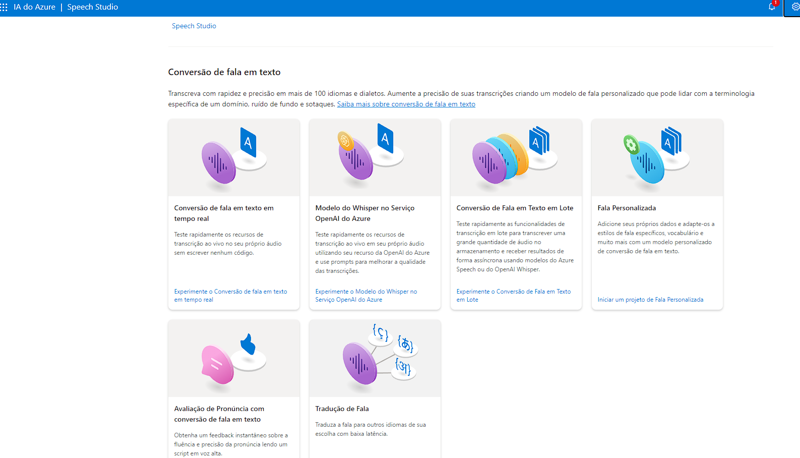
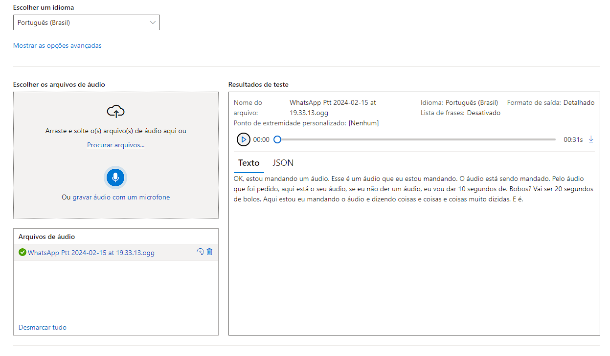
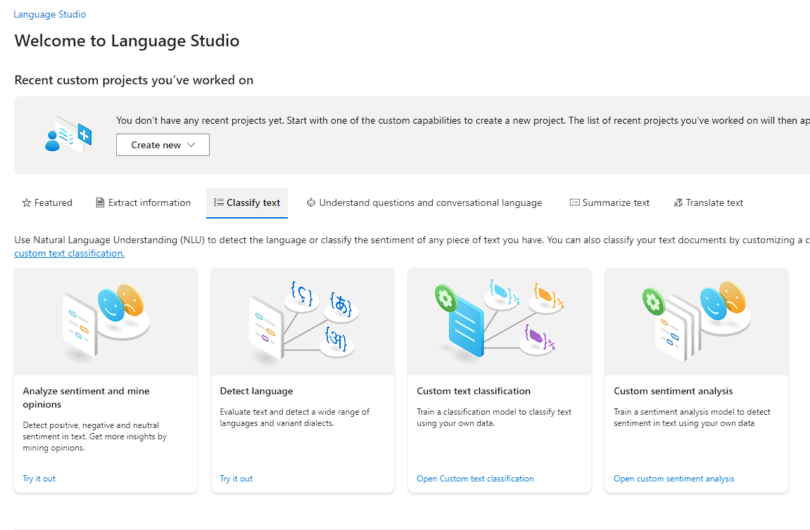
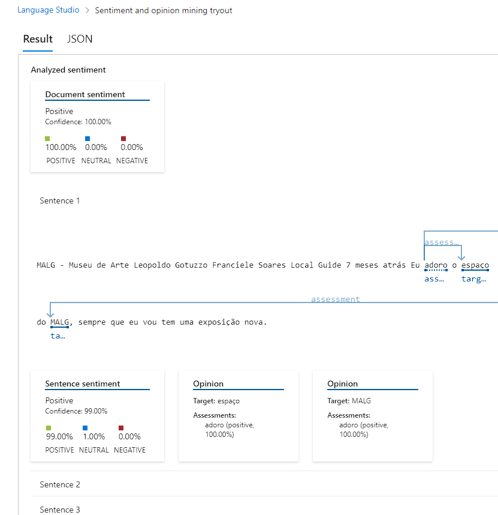
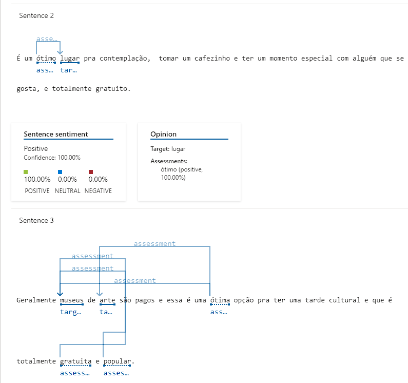

# 🧪 Lab03 - Visão Computacional 

- https://speech.microsoft.com/
- https://language.cognitive.azure.com/

## Laboratórios relacionados aos estúdios Speech Studio e Language Studio
Docs úteis: 
- https://microsoftlearning.github.io/mslearn-ai900/

### Speech Studio:

O Speech Studio permite a conversão em tempo real de fala para texto, com a geração automática do resultado.

1. Após criar o Resource Group com o recurso, vá em "Conversão de fala em texto em tempo real"

2. Dentro da nova aba, escolha o idioma do áudio que será convertido e escolha o arquivo ou grave a própria fala. Assim, o resultado será gerada automaticamente como texto

### Language Studio:

O Language Studio oferece análise de sentimentos e opiniões em texto, com a possibilidade de inserir texto diretamente na caixa de entrada para análise.

1. Após configurar o RG, no site do serviço vá na aba de "Classify text" e clique no primeiro card, que diz "Analyze sentiment and mine opinions"

2. Na nova aba, inserir o texto que será analisado. Podemos usar como input um arquivo ou então escrever na própria caixa de texto, como está a baixo e depois clicar em Run:

