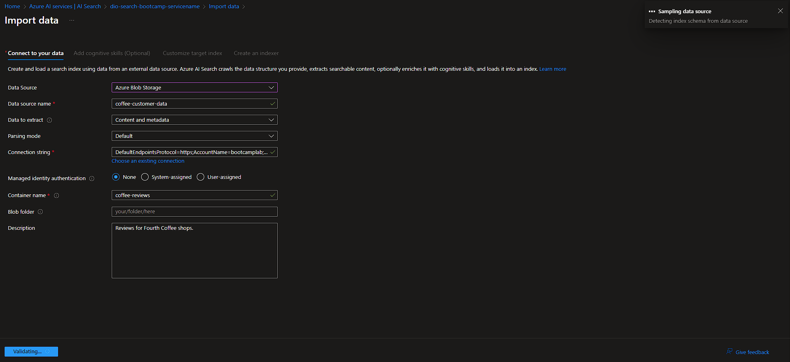
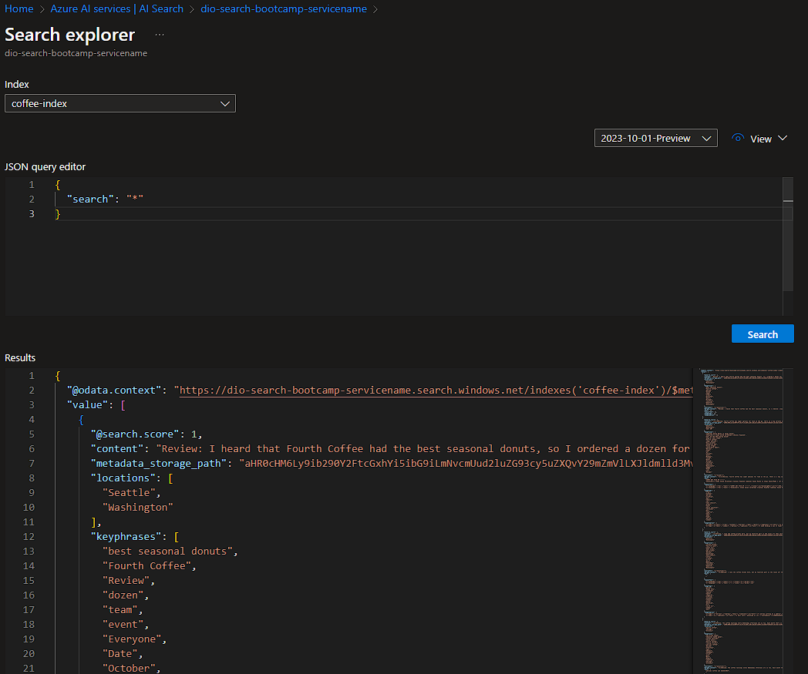
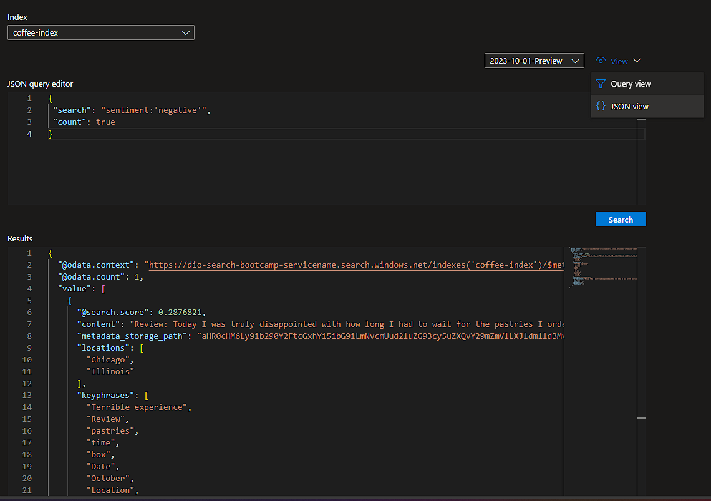
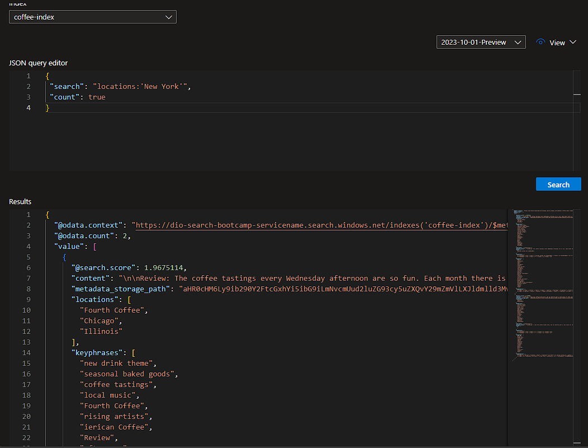

# 🧪 Lab04 - Inteligência de Documentos e Mineração de Conhecimento

Azure AI Search é um serviço de pesquisa na nuvem da Microsoft, fornecendo capacidades avançadas de busca e relevância para aplicativos. Ele permite indexar, buscar e analisar facilmente grandes conjuntos de dados para fornecer uma experiência de pesquisa eficiente em diversas aplicações.

## Laboratório relacionado aos serviços Azure AI Search e Azure AI Services

**Documentação para o Laboratório:**
- https://microsoftlearning.github.io/mslearn-ai-fundamentals/Instructions/Labs/11-ai-search.html

1. Após criar os recursos do Azure AI Search, Azure AI Service e o Storage Account devidamente configurado (permitindo acesso anônimo ao Blob) deve-se adicionar alguns arquivos ao container dentro do Storage Account, da seguinte maneira:

- Criando o container com a configuração "Container (anonymous read access for containers and blobs)":
    

- Feita a criação, vá até a documentação no início desse readme e baixe o zip com os arquivos que serão usados no laboratório, depois disso basta fazer o upload no container:
    1- 
    2- 

2. Para indexar os documentos que foram upados, vá no serviço AI Search que foi criado anteriormente e clique em "Import data" para selecionar onde estão os dados cognitivos (no Blob):
- Data Source: Azure Blob Storage
- Data source name: coffee-customer-data
- Data to extract: Content and metadata
- Parsing mode: Default
- Connection string: *Select Choose an existing connection. Select your storage account, select the coffee-reviews container, and then click "Select"
- Managed identity authentication: None
- Container name: this setting is auto-populated after you choose an existing connection.
- Blob folder: Leave this blank.
- Description: Reviews for Fourth Coffee shops.



- Selecione "Add cognitive skills (Optional)" e em "Add enrichments":

    - Mude o nome do Skillset para "coffee-skillset"
    - Selecione o checkbox "Enable OCR and merge all text into merged_content"
    - Se assegure de que o campo "Enrichment granularity level" esteja como: Pages (5000 character chunks)
- Para podermos realizar a busca de forma mais concisa, faça as seguintes configurações:

| Cognitive Skill                      | Parameter                    | Field name      |
|--------------------------------------|------------------------------|-----------------|
| Extract location names               |                              | locations       |
| Extract key phrases                  |                              | keyphrases      |
| Detect sentiment                     |                              | sentiment       |
| Generate tags from images            |                              | imageTags       |
| Generate captions from images        |                              | imageCaption    |

- Em "Save enrichments to a knowledge store", deixe selecionado os campos:
Image projections
Documents
Pages
Key phrases
Entities
Image details
Image references

3. Seleção das projeções do blob Azure: Selecione "Document" como a projeção. O nome do contêiner deve ser preenchido automaticamente com "knowledge-store". Não altere o nome do contêiner.

- Personalização do índice de destino: Altere o nome do índice para "coffee-index". Certifique-se de que a chave esteja definida como "metadata_storage_path". Deixe o nome do Sugeridor em branco e o modo de pesquisa autopreenchido.

- Revisão das configurações padrão dos campos do índice: Selecione "filtrável" para todos os campos que já estão selecionados por padrão.

- Seleção de opções avançadas e submissão: Selecione "Criar um indexador". Altere o nome do Indexador para "coffee-indexer". Deixe o agendamento como "Uma vez". Expanda as opções avançadas e verifique se a opção "Codificar chaves em Base-64" está selecionada. Clique em "Enviar" para criar a fonte de dados, o conjunto de habilidades, o índice e o indexador. O indexador será executado automaticamente e executará o pipeline de indexação.

- Verificação do status do indexador: Retorne à página do recurso Azure AI Search. No painel esquerdo, em "Gerenciamento de Pesquisa", selecione "Indexadores". Selecione o indexador recém-criado "coffee-indexer". Aguarde um minuto e selecione "Atualizar" até que o status indique "sucesso".

4. Para realizar *queries* ou fazer buscas pelos documentos que foram upados anteriormente com as avaliações dos clientes sobre o Café, vá no AI Search que foi criado e depois em "Search Explorer" e assim, você estará no local principal de realizar as pesquisar:



5. Coloque a opção de visualização como Json e filtre por sentimento ou localidade, como esses exemplos:

````
{
 "search": "sentiment:'negative'",
 "count": true
}
````

Ou

````
{
 "search": "locations:'New York'",
 "count": true
}
````




> Com a configuração realizada, estabelecemos um ambiente no Azure AI Search para indexar e buscar documentos de forma eficiente. Inicialmente, configuramos o container no Azure Blob Storage e carregamos os arquivos necessários. Em seguida, no Azure AI Search, definimos a fonte de dados como o Azure Blob Storage, configuramos o Skillset para enriquecer os documentos e personalizamos o índice de destino. 
> Posteriormente, criamos um indexador para automatizar o processo de indexação dos documentos. Agora, com o indexador em execução, conseguimos pesquisar e realizar consultas refinadas utilizando o Search Explorer, filtrando os resultados por sentimentos ou localidades, conforme necessário. Essa configuração permite uma análise profunda dos documentos, oferecendo insights valiosos para uma aplicação.
