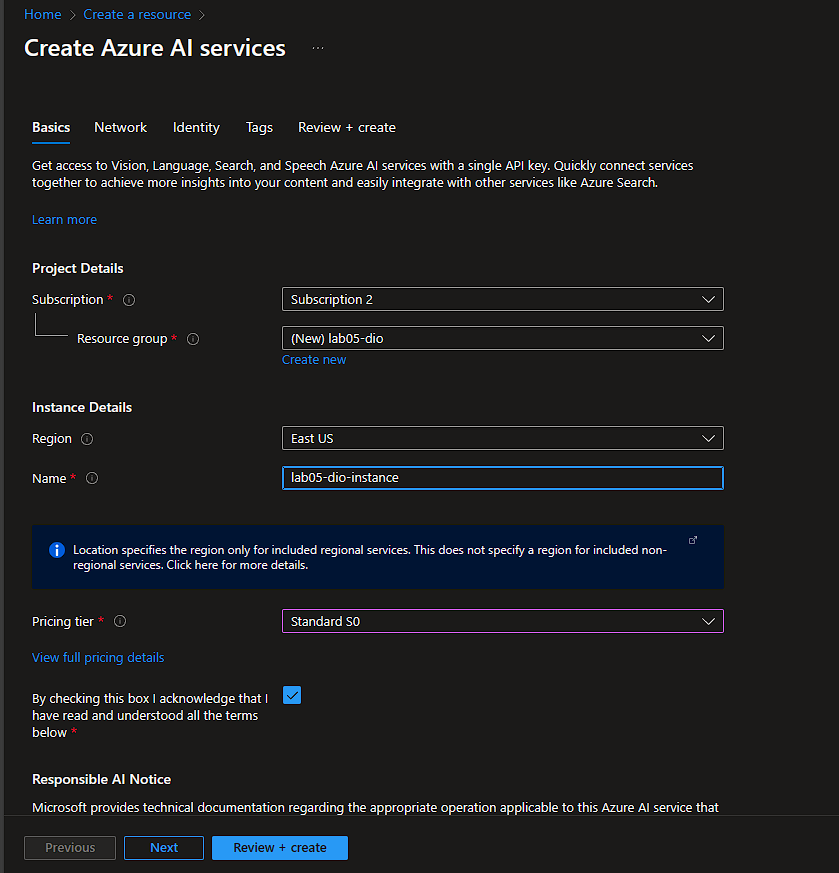
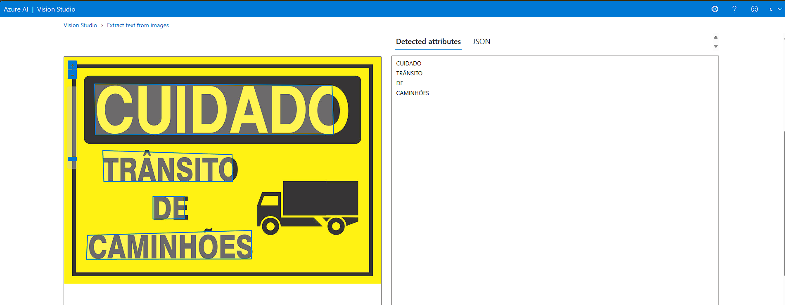
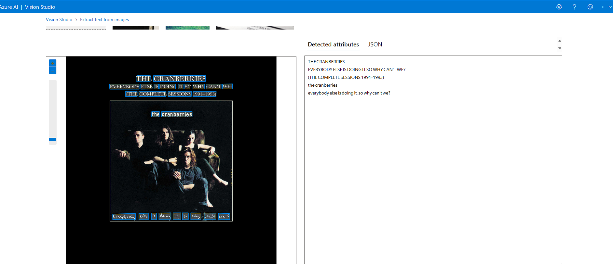
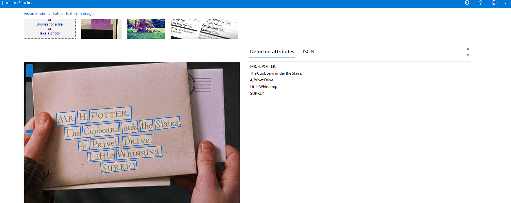
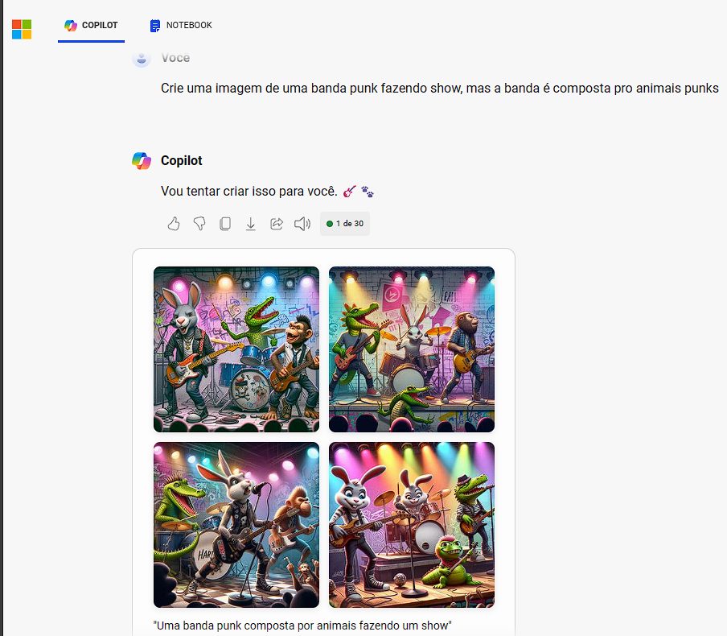

# 🧪 Lab05 - Inteligência Artificial Generativa

 Atividade prática que aborda não apenas o Azure AI Vision Studio, mas também o Copiloto como Gerador de Imagem. Este laboratório visa explorar e entender as capacidades de geração de imagem oferecidas pelo Copilot e de OCR vinda do AI Vision Studio.

## Azure AI Vision Studio

1. Após criar o Resource Group de Azure AI Services:

2. Acessando o https://portal.vision.cognitive.azure.com/, entre na aba de OCR e envie as imagens com texto:

O serviço consegue interpretar e extrair texto até mesmo em imagens com condições de iluminação desafiadoras, como esta imagem que tem uma iluminação mais escura e o serviço ainda consegue compreender as letras feitas à mão.

## Gerando imagens com o Copilot

1. Ao fornecer um prompt, por mais surreal que seja, o Copilot consegue gerar a imagem:

Esse laboratório ofereceu uma experiência prática e esclarecedora sobre as habilidades de geração de imagem do Azure AI Vision Studio e do Copilot. O Vision Studio destacou-se na interpretação precisa de texto em imagens, mesmo em situações desafiadoras, como iluminação fraca e escrita à mão. Enquanto isso, o Copilot impressionou ao criar imagens a partir de prompts, inclusive em contextos surrealistas. Essa atividade proporcionou insights valiosos sobre o potencial da inteligência artificial na geração e compreensão de imagens.